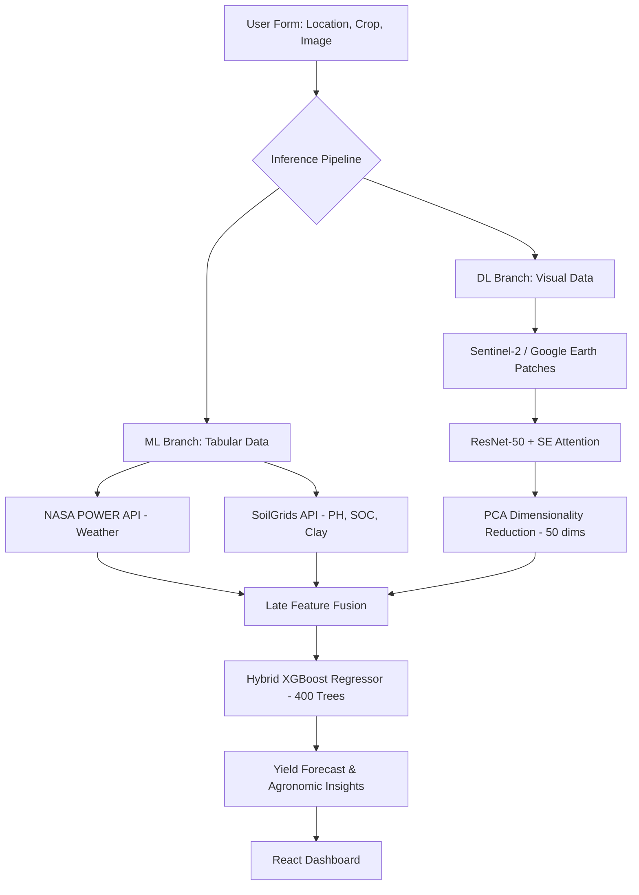

# Satellite-Based Precision Agriculture 🛰️🌾

[](https://www.python.org/downloads/)
[](https://nodejs.org/)
[](LICENSE)
[]()
[]()

An end-to-end multi-modal system for satellite-based precision agriculture. This project combines classical **Machine Learning (XGBoost)**, **Deep Learning (ResNet-50 + SE Attention)**, and **Hybrid Feature Fusion** to predict crop yields and monitor land-use across India and global regions.

---

## 🏗️ System Architecture



---

## 📊 Phase-wise Results

| Phase | Paradigm | Target Task | Performance |
|-------|----------|-------------|-------------|
| **Phase 1** | Classical ML | Winter Wheat Yield (Kansas) | **R² = 0.85**, RMSE = 0.45 t/ha |
| **Phase 2** | Deep Learning | Land Cover Classification | **98.20% Accuracy** (EuroSAT) |
| **Phase 3** | **Hybrid Fusion** | **Multi-Crop Yield (India)** | **R² = 0.989**, MAE = 0.68 t/ha |

---

## 🛠️ Tech Stack

- **ML/DL:** Python, PyTorch, XGBoost, Scikit-learn, PCA, Joblib.
- **Computer Vision:** ResNet-50, Squeeze-and-Excitation (SE) Attention, Vision Transformers (ViT), Grad-CAM, t-SNE.
- **Frontend:** React, Vite, Tailwind CSS, Recharts.
- **Backend:** Node.js, Express, Python Subprocesses.
- **Data/APIs:** NASA POWER (Weather), SoilGrids (Soil), EuroSAT & RESISC-45 (Satellite).
- **Optimization:** INT8 Quantization, Cosine Annealing, AdamW.

---

## 📁 Repository Structure

- `Phase1_ML/`: Classical ML pipeline (XGBoost/Random Forest) for wheat yield.
- `Phase2_DL/`: Deep learning experiments on EuroSAT/RESISC-45 with CNNs and ViT.
- `Phase3_Hybrid/`: The primary end-to-end hybrid system and 12-crop predictive model.
- `crop-prediction-webapp/`: Production-ready full-stack application (React/Node.js).
- `scripts/`: Utility scripts for quick training and pipeline execution.

---

## ⚡ Quick Start (In 3 Commands)

1. **Setup & Train ML:**
   ```bash
   ./scripts/quickstart.sh
   ```

2. **Run Backend (Port 4000):**
   ```bash
   cd crop-prediction-webapp/backend && npm install && npm start
   ```

3. **Run Frontend (Port 3000):**
   ```bash
   cd crop-prediction-webapp/frontend && npm install && npm run dev
   ```

Open **http://localhost:3000** to start predicting.

---

## 📜 Full Documentation

- **Phase 1 ML Report:** [PROJECT_REPORT.tex](Phase1_ML/reports/PROJECT_REPORT.tex)
- **Phase 2 DL Walkthrough:** [Phase2_Explanation.md](Phase2_DL/Phase2_Explanation.md)
- **Phase 3 Hybrid Design:** [Phase3_Explanation.md](Phase3_Hybrid/Phase3_Explanation.md)
- **Web App Setup:** [crop-prediction-webapp/README.md](crop-prediction-webapp/README.md)

---

## 📝 Citation & Author

```bibtex
@software{satellite_precision_agri_2026,
  author = {Jain, Rhythm},
  title = {Satellite-Based Precision Agriculture: Hybrid ML+DL Multi-Crop System},
  year = {2026},
  url = {https://github.com/monurajj/Satellite-Based-Precision-Agriculture}
}
```

Built with ❤️ for sustainable agriculture and data-driven farming.
